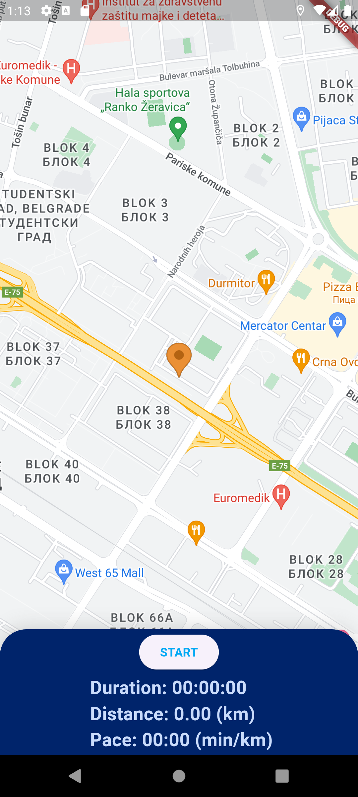
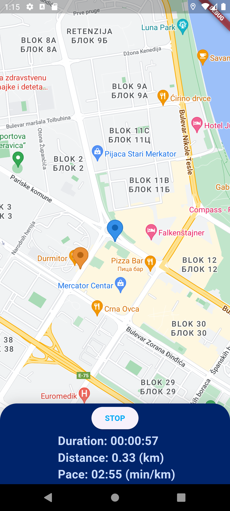

# DayOne

A mobile app developed in Flutter framework (Dart language) to help runners track their runs by measuring distance and time.

## About the Project

DayOne is an easy-to-use mobile software created for runners (or cyclists, come to think of it). It utilizes Google Maps API, offering real-time tracking of your run. DayOne helps you monitor your progress, set goals, and stay motivated. Key features include:
- Start and stop run tracking with a single tap
- Real-time display of your start and current position on a map
- Statistics on duration, distance, and pace
- Simple and intuitive user interface

Ideas to be implemented in the future:
- Saving your runs
- Real-time rendering of the route covered

## Technologies and Programming Language

- Flutter framework
- Dart programming language
- Google Maps API

The app was built in Android Studio.

## Installation and Running the App

1. Download the latest APK file from the releases section.
2. Install the APK on your Android device.
3. Open the app and grant necessary permissions to access location services.

## Supported OS

The app is designed for Android OS.

## Authors

- Luka Matić (mi21056@alas.matf.bg.ac.rs)
- Jelena Mihajlović (mi21068@alas.matf.bg.ac.rs)
